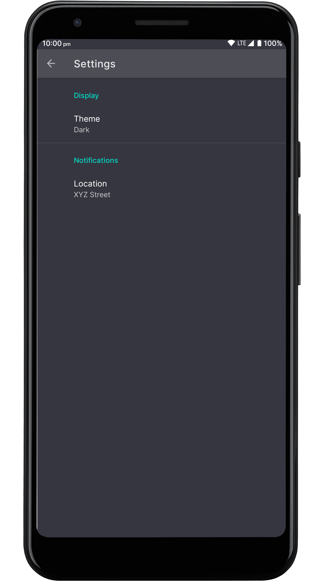
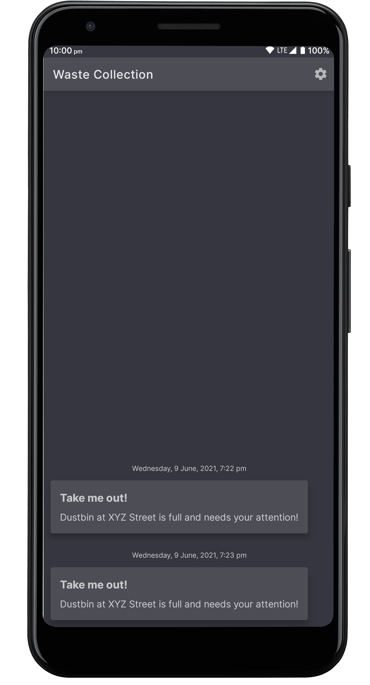

= IoT Waste Management Android App
:toc: macro
:toc-title!:
:figure-caption!:

This is a part of our IoT waste management system project, implemented as a part of our Internet of Things course.
The app receives (and stores) push notifications when the dustbin is full.

The app uses https://onesignal.com[OneSignal] for receiving notifications.
The app is written in Kotlin and uses the following libraries/components:

* Foundation:

** AppCompat
** Android KTX

* Architecture:

** Data binding
** LiveData
** Navigation
** Room
** ViewModel

* UI:

** Fragment
** Layout

* Miscellaneous:

** Hilt

[discrete]
== Table of Contents

toc::[]

== Building

Before you proceed with building the app, you'll need to obtain your OneSignal app ID.

* Create a OneSignal account if you don't have one already.

* Generate a Firebase server key.
Refer to https://documentation.onesignal.com/docs/generate-a-google-server-api-key[the OneSignal docs] for more information.

* Create a OneSignal app.
You can then obtain the app ID from the OneSignal dashboard.
For more information on how to find your app ID, refer to https://documentation.onesignal.com/docs/accounts-and-keys[the docs].

After you've obtained the OneSignal app ID, create a `secrets.properties` file with the following contents, using your app ID instead:

[source]
--
ONESIGNAL_APP_ID=8250eaf6-1a58-489e-b136-7c74a864b434
--

To build this project, you can then use the `./gradlew assembleDebug` command (to build a debug APK) or use "Import Project" in Android Studio.

== Screenshots

ifdef::env-github[]

++++

  
   
  Settings page
   

  
   
  Home page
   

++++
endif::[]

ifndef::env-github[]
.Settings page
[link=img/settings.png]

.Home page
[link=img/main.png]

endif::[]

== License

link:LICENSE[Apache-2.0]
