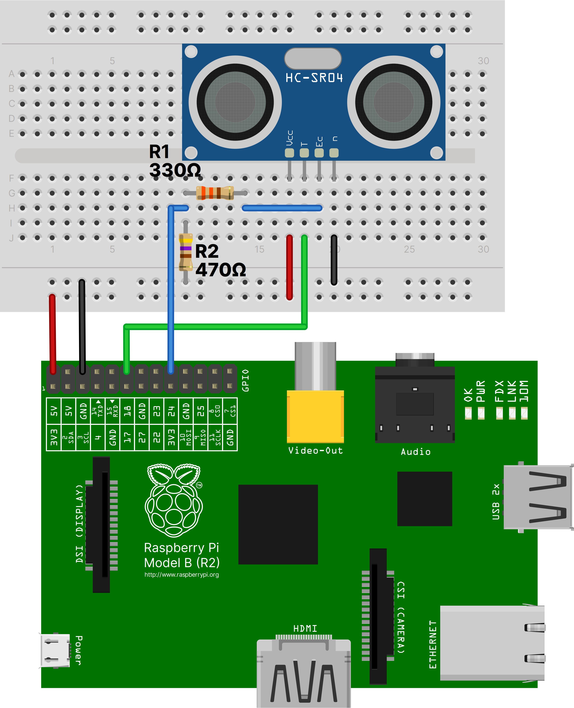

= IoT Waste Management Publisher
:toc: macro
:toc-title!:

This is a part of our IoT waste management system project, implemented as a part of our Internet of Things course.
This component of the project would run on a Raspberry Pi connected to an ultrasonic ranging module (the HC-SR04 in our case).

The basic functionality is to periodically measure the distance, which would determine how full a trash can is.
When the distance is less than a certain threshold value, the Pi connects to an MQTT broker and publishes the current status.

[discrete]
== Table of Contents

toc::[]

== Installation

You can either choose to compile it on the target machine (a Raspberry Pi), or to cross compile on a more powerful machine and install it on the target machine.
We'd recommend cross compiling it if the target device has less than 4 GB RAM.

=== Build From Source

To build this project from source *on the target machine (the Pi)*, you need to have Rust installed.
The *nightly toolchain* is required to build this project.
Refer to https://www.rust-lang.org/tools/install[the docs] for more information on installing Rust.

You can then use cargo to build everything:

[source, shell]
--
git clone https://github.com/SanchithHegde/iot-waste-mgmt-pub
cd iot-waste-mgmt-pub
cargo install --path .
--

This will place the binary at `${CARGO_HOME}/bin`, which should be present in your `${PATH}` to run the binary.

=== Cross Compilation

You'll need to install https://github.com/rust-embedded/cross[cross] and all of its dependencies before proceeding.

* Note the version number for the latest stable OpenSSL release (`1.1.1k` as of writing this) by visiting https://www.openssl.org/source/[their downloads page].
Update the line containing `local version=1.1.1k` in the `docker/openssl.sh` file to reflect the same.

* Build the Docker container image:
+
[source, shell]
--
docker build -f docker/arm-unknown-linux-gnueabihf.Dockerfile -t "arm-gnueabihf:$(date --iso-8601=seconds)" -t 'arm-gnueabihf:latest'
--
+
If you use `podman` for building the container image, just replace `docker` in the above command by `podman`.
+
[NOTE]
We only have the Dockerfile for the Raspberry Pi B Rev. 2, which is an ARMv6 device.
For newer devices, you'll have to create a Dockerfile for the corresponding target architecture.

* You can then build the project using:
+
[source, shell]
--
cross build --release --target arm-unknown-linux-gnueabihf
--
+
[NOTE]
The target triple will be different for newer devices.

Move the built binary to any directory present in `${PATH}` on the target machine.

== Configuration

TODO

=== TLS Certificates

TODO

== Circuit Connections

== Usage

TODO

=== Logging

TODO

== License

Dual licensed under Apache 2.0 or MIT at your option.

See the link:LICENSE-APACHE[] and link:LICENSE-MIT[] files for license details.
